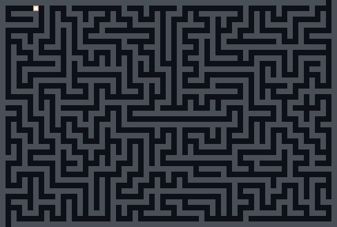

# maze

[](https://github.com/aaronding/maze/actions/workflows/test.yml)
[](LICENSE)

A mouse explores a maze in your terminal, one step at a time, using depth-first search with backtracking. It maps every reachable corridor and reports each exit it finds.



## Run it

Requires Node.js 22 or later.

```sh
yarn
yarn go
```

Use `--delay` to change the speed (milliseconds per step, default 25):

```sh
yarn go --delay 100
```

## How it works

The mouse only knows its own position, relative to where it started, and the open cells next to it. On each step it:

1. Asks the maze which neighbouring cells are open.
2. Moves into the first one it hasn't visited yet, and pushes that direction onto a history stack.
3. When every neighbour has been visited, it pops the stack and steps back the opposite way.
4. When it reaches the edge of the maze, it records that cell as an exit.

Exploration ends when the stack is empty and the mouse is back at the start. Every open cell is visited once, and every move is undone at most once, so a run takes O(cells) steps. The bundled 61×41 maze takes 2,402 steps and has 2 exits.

The search uses an explicit stack rather than recursion, so the renderer can draw each step and the call stack stays flat on large mazes.

## Project layout

| File | Role |
| --- | --- |
| `app.js` | Entry point: parses `--delay` and starts the game |
| `game.js` | Runs the step loop and redraws the terminal |
| `maze.js` | Grid queries (open neighbours, exit detection) and rendering |
| `mouse.js` | Position, visited set, history stack, and backtracking |
| `mazeData.js` | The maze grid (`1` = wall, `0` = open) and start position |
| `archive/simplemaze.js` | The first version: a recursive solver, kept for reference |

## Tests

```sh
yarn test
```

The tests cover the grid and movement helpers and the full solver: finding exits, finishing cleanly when there are none, and never stepping through a wall.

## License

[MIT](LICENSE)
